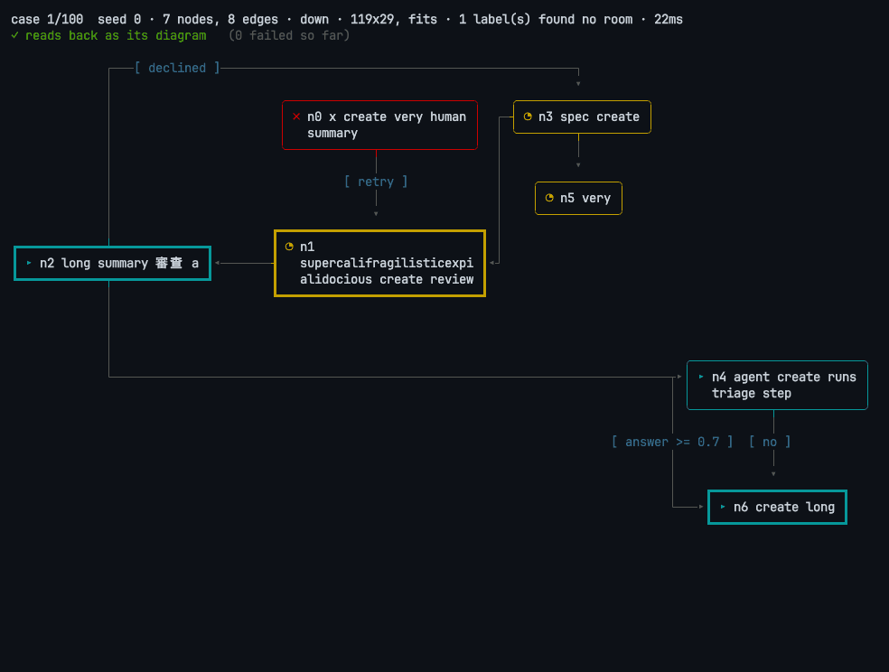

# cligram

Flow diagrams for the terminal, from Mermaid, YAML or Go. Drawn in
text: boxes, decisions and labelled edges, laid out to fit your terminal,
and repainted live as a run moves through them.

[](https://asciinema.org/a/gWsYXyq89czfDDtD)

*100 random diagrams, each drawn and then read back from the text alone to
check it says what the diagram says. Click to play.*

```sh
go install github.com/isacikgoz/cligram/cmd/cligram@latest   # the command
go get github.com/isacikgoz/cligram                          # the library
```

## From YAML

```yaml
title: Release
nodes:
  triage: Triage
  ready:
    text: Ready to ship?
    kind: decision
  ship: { text: Ship it, kind: end }
  fix: { text: Fix it, class: agent }
edges:
  - triage -> ready
  - ready -> ship: yes
  - ready -> fix: no
  - fix -> ready
```

```sh
cligram -width 80 examples/release.yaml
```

```text
Release

╭──────────╮    ╔══════════════════╗              ┏━━━━━━━━━━━┓
│   Triage ├───▸║   Ready to ship? ╟─┬─[ yes ]───▸┃   Ship it ┃
╰──────────╯    ╚══════════════════╝ │            ┗━━━━━━━━━━━┛
                         ▴           │
                         │           │
                         │           │            ╭──────────╮
                         │           └───[ no ]──▸│   Fix it │
                         │                        ╰────┬─────╯
                         │                             │
                         └─────────────────────────────┘
```

A node is a text, or `text`, `kind` (`step`, `decision` or `end`), `class`
and `at`, a placement such as `right of ready` or `below a and b`. Without
`-width`, the drawing fits the terminal it is printed to.

## From Go

```go
d := cligram.New()
d.Node("triage", "Triage")
d.Node("ready", "Ready to ship?", cligram.As(cligram.Decision))
d.Node("ship", "Ship it")
d.Node("fix", "Fix it", cligram.Class("agent"))
d.Edge("triage", "ready")
d.Edge("ready", "ship", cligram.Label("yes"))
d.Edge("ready", "fix", cligram.Label("no"))
d.Edge("fix", "ready")

l := d.Layout(cligram.Fit(80, 24))
fmt.Println(l.Render(cligram.State{
	Status: map[string]cligram.Status{"triage": cligram.Done, "ready": cligram.Active},
	Taken:  []cligram.EdgeRef{{From: "triage", To: "ready"}},
}, cligram.Plain))
```

```text
╭──────────╮    ╔══════════════════╗              ╭───────────╮
│ ✓ Triage ├───▸║ ▸ Ready to ship? ╟─┬─[ yes ]───▸│   Ship it │
╰──────────╯    ╚══════════════════╝ │            ╰───────────╯
                         ▴           │
                         │           │
                         │           │            ╭──────────╮
                         │           └───[ no ]──▸│   Fix it │
                         │                        ╰────┬─────╯
                         │                             │
                         └─────────────────────────────┘
```

Lay out once per size, then repaint as often as the run moves: a box never
moves when its state changes. Use `cligram.ANSI`, or a `Palette` of your
own colors, instead of `cligram.Plain` for color.

## For agents

An agent already writes Mermaid; cligram shows it. Pipe a flowchart in:

```sh
cligram -width 80 <<'EOF'
flowchart LR
  task([Task]) --> plan[Plan] --> act[Run tools]
  act --> check{Done?}
  check -->|no| plan
  check -->|yes| done([Answer])
EOF
```

```text
                ┌───[ no ]────────────────────┐
                ▾                             │
┏━━━━━━━━┓  ╭────────╮  ╭─────────────╮  ╔════╧════╗              ┏━━━━━━━━━━┓
┃   Task ┠─▸│   Plan ├─▸│   Run tools ├─▸║   Done? ╟───[ yes ]───▸┃   Answer ┃
┗━━━━━━━━┛  ╰────────╯  ╰─────────────╯  ╚═════════╝              ┗━━━━━━━━━━┛
```

`[text]` is a step, `{text}` a decision, `([text])` an end, `-->|label|`
labels an edge; the rest of Mermaid's flowchart syntax is read, and what
cligram does not draw (styles, subgraph frames) is left out.

- **A skill**: `npx skills add isacikgoz/cligram` teaches Claude Code and
  other agents when to draw and how ([SKILL.md](.claude/skills/cligram/SKILL.md)).
- **An MCP server**: `claude mcp add cligram -- cligram mcp` gives an agent
  a `draw` tool, which returns the drawing and what to fix when something
  did not fit.
- **JSON**: `cligram -json` writes the drawing, its size, whether it fits
  and its warnings, for a program to check.

## More

- **Placement**: `cligram.At("right of x")` pins a node; everything else is
  placed by following the edges.
- **Fitting**: `Fit(w, h)` compacts, wraps the flow like a snake, turns it,
  or narrows text, and `Reveal` with `RenderView` scrolls what still does
  not fit.
- **Live in a TUI**: package `bubble` is a Bubble Tea component with keyboard
  focus that follows the run and nodes that open into sub-diagrams.
  `go run ./examples/live` shows one.

[AGENTS.md](AGENTS.md) is the full guide; [docs/design.md](docs/design.md)
has the decisions behind it.

## License

MIT, see [LICENSE](LICENSE).
