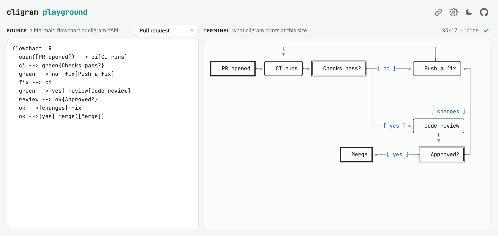
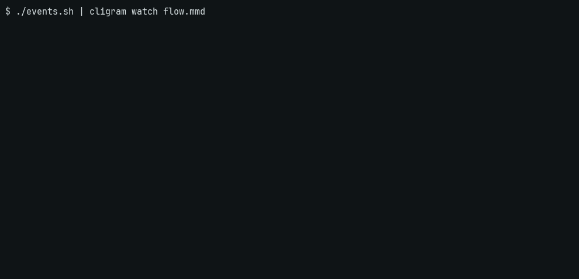

# cligram

Mermaid flowcharts, drawn in your terminal: laid out to fit it, and live as
a run moves through them.

<a href="https://isacikgoz.me/cligram/">
  <picture>
    <source media="(prefers-color-scheme: dark)" srcset="docs/playground-dark.png">
    
  </picture>
</a>

**[Try the playground](https://isacikgoz.me/cligram/)**: paste a flowchart, see it drawn.

## Use it

```sh
brew install isacikgoz/tap/cligram
# or a binary from https://github.com/isacikgoz/cligram/releases, or
go install github.com/isacikgoz/cligram/cmd/cligram@latest
```

```sh
cligram -width 80 <<'EOF'
flowchart LR
  task([Task]) --> plan[Plan] --> act[Run tools]
  act --> check{Done?}
  check -->|no| plan
  check -->|yes| done([Answer])
EOF
```

```text
                ┌───[ no ]────────────────────┐
                ▼                             │
┏━━━━━━━━┓  ╭────────╮  ╭─────────────╮  ╔════╧════╗              ┏━━━━━━━━━━┓
┃   Task ┠─►│   Plan ├─►│   Run tools ├─►║   Done? ╟───[ yes ]───►┃   Answer ┃
┗━━━━━━━━┛  ╰────────╯  ╰─────────────╯  ╚═════════╝              ┗━━━━━━━━━━┛
```

Without `-width` it fits the terminal it prints to. Subgraphs draw as
titled frames. It reads state diagrams (`stateDiagram-v2`) too, and cligram's YAML ([examples/release.yaml](examples/release.yaml)), and `cligram md
README.md` prints Markdown with its mermaid blocks drawn.

`cligram watch` shows a run live: pipe it events, one a line.



```sh
(echo "build active"
 if make >build.log 2>&1; then echo "build done"; else echo "build failed"; fi
) | cligram watch flow.mmd
```

## From Go

```go
d := cligram.New()
d.Node("triage", "Triage")
d.Node("ready", "Ready to ship?", cligram.As(cligram.Decision))
d.Node("ship", "Ship it")
d.Node("fix", "Fix it", cligram.Class("agent"))
d.Edge("triage", "ready")
d.Edge("ready", "ship", cligram.Label("yes"))
d.Edge("ready", "fix", cligram.Label("no"))
d.Edge("fix", "ready")

l := d.Layout(cligram.Fit(80, 24))
fmt.Println(l.Render(cligram.State{
	Status: map[string]cligram.Status{"triage": cligram.Done, "ready": cligram.Active},
	Taken:  []cligram.EdgeRef{{From: "triage", To: "ready"}},
}, cligram.Plain))
```

Lay out once per size, then repaint as the run moves: boxes never move.
Package `bubble` is a Bubble Tea component with keyboard focus and
sub-diagrams; `go run ./examples/live` shows it.

## For agents

- **Skill**: `npx skills add isacikgoz/cligram`
- **MCP**: `claude mcp add cligram -- cligram mcp` gives a `draw` tool
- **JSON**: `cligram -json` returns the drawing, its size and its warnings

[AGENTS.md](AGENTS.md) is the full guide. MIT licensed.
